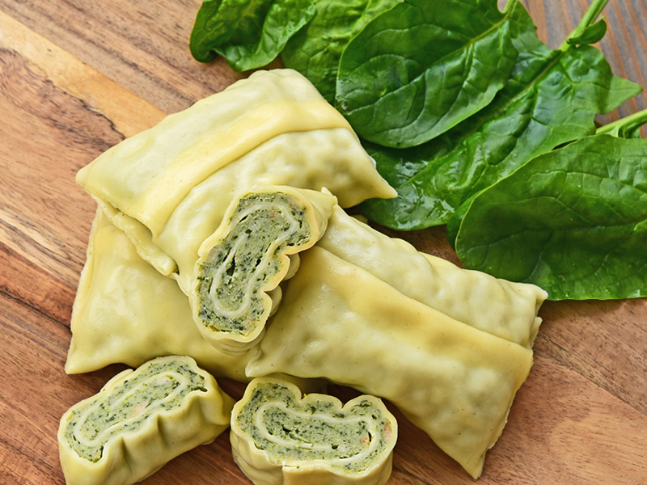

# Rezept #1: Lieblingsrezept

## Eierkuchen

## Zutaten (4 Portionen)

| Menge | Zutat |
|-:|:-|
| 400 g | (Vollkorn-) Mehl |
| 750 ml | fettarme Milch |
| 3 große | Eier |
| 1 Prise | Salz |
| 1 Schuss | Mineralwasser |
| | Butter oder Öl zum Backen |
| nach Belieben | Zucker & Zimt, Apfelmus, Nutella, usw.
 

## Zubereitung

#### Benötigte Küchenutensilien:
Pfanne (beschichtet), Rührschüssel, Handrührgerät, Pfannenwender, ggf. Schöpfkelle
 
 

| Zubereitungszeit | Dauer |
|-|-|
| Vorbereitungszeit | 5 min |
| Ruhezeit | 30 min |
| Backzeit | 10 min |
| Gesamtzeit | 45 min |
 

- Mehl, Milch, Eier und Salz mit dem Handrührgerät zu einem glatten Teig verrühren, bis dieser Blasen wirft. Den Teig anschließend ca. 30 Minuten im Kühlschrank ruhen lassen.
- Den Teig aus dem Kühlschrank nehmen, einen guten Schuss Mineralwasser hinzufügen und nochmals rühren.
- Den Herd auf höchster Stufe aufheizen und etwas Butter bzw. Öl in die Pfanne geben.
- Die Pfanne von der Herdplatte nehmen, sobald die Butter bzw. das Öl gleichmäßig in der verteilt ist. Anschließend eine Schöpfkelle Teig in die Pfanne geben und ebenfalls gleichmäßig verteilen. Den Herd auf die mittlere Stufe herunterregeln und die Pfanne wieder auf die Herdplatte stellen.
- Den Teig so lange backen lassen, bis er überwiegend fest geworden und die Unterseite goldbraun geworden ist. In dieser Zeit mehrmals mit dem Pfannenwender die Teigunterseite kontrollieren.
- Den Teig wenden, sobald er sich leicht von der Pfanne lösen lässt. Abschließend von der zweiten Seite goldbraun fertigbacken lassen.
- Den fertigen Eierkuchen auf einen großen Teller legen und nach Belieben garnieren, einrollen, schneiden... endlose Möglichkeiten!
 

---

# Rezept #2: Rezept aus Baden-Württemberg

## Schwäbische Maultaschen

## Zutaten (10 Portionen)

| Menge | Zutat |
|-:|:-|
| 1 kg | Mehl |
| 8 | Eier |
| 10 EL | Wasser |
| 2 TL | Salz |
| 500 g | TK-Rahmspinat, aufgetaut |
| 500 g | Hackfleisch, gemischt |
| 500 g | Mett bzw. Brät |
| 200 g | Schwarzwälder Schinken |
| 2 | Eier |
| 2 EL | Paniermehl |
| 1 | Zwiebel |
| | Salz, Pfeffer, Muskat, Majoran, Petersilie
 

## Zubereitung

#### Benötigte Küchenutensilien:
Handrührgerät, Teigrolle, Rührschüssel, Teigrad
 
 

| Zubereitungszeit | Dauer |
|-|-|
| Vorbereitungszeit | 50 min |
| Ruhezeit | 60 min |
| Kochzeit | 10 min |
| Gesamtzeit | 120 min |
 

- Die ersten 4 Zutaten miteinander vermengen, um den Nudelteig zuzubereiten.
- Die Zwiebel und den Schinken klein schneiden, den Rahmspinat abgießen, alle verbleibenden Zutaten gut durchmischen sowie mit den Gewürzen abschmecken.
- Den Teig in 2 Stücke teilen und dünn rechteckig ausrollen.
- Die Füllung mit 2 Teelöffeln häufchenweise mit etwas Abstand auf die eine Teighälfte verteilen, die anderen Teighälfte darüber klappen und zwischen den Häufchen gut andrücken. Mit einem Teigrädchen die Taschen in den Zwischenräumen schneiden und nochmals gut andrücken.
- Die Maultaschen in kochendes Salzwasser geben und ca. 10 Minuten garen. Anschließend die Taschen aus dem Wasser holen und mit kaltem Wasser abspülen.